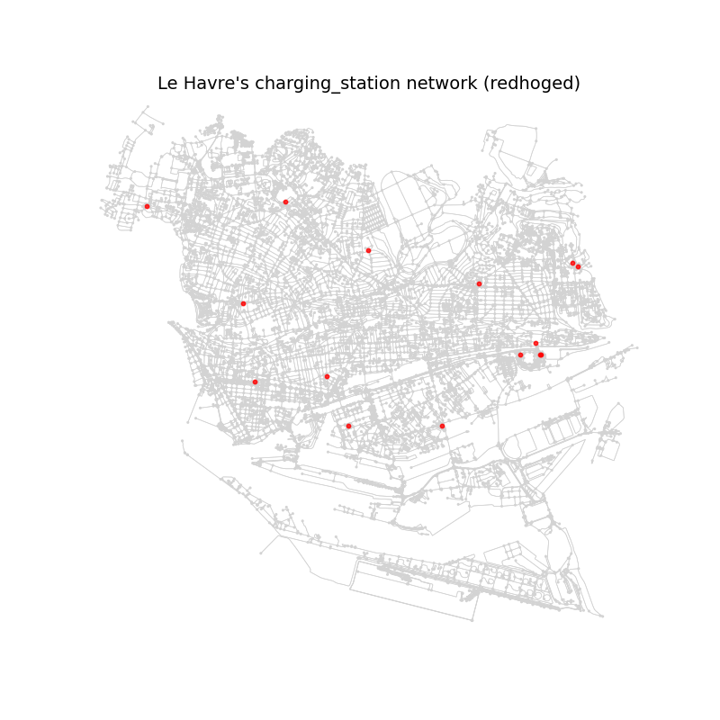
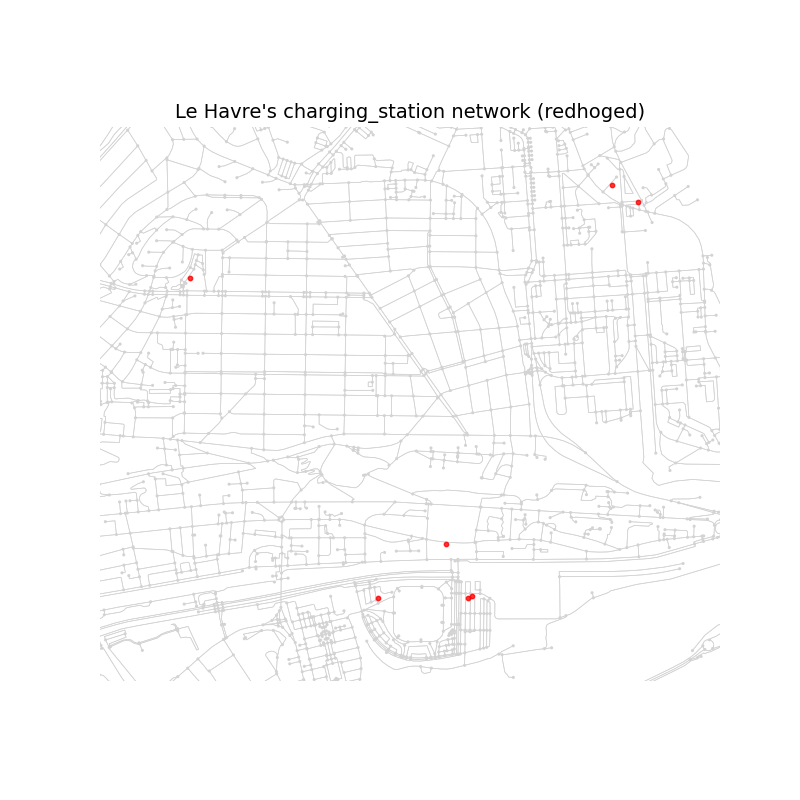
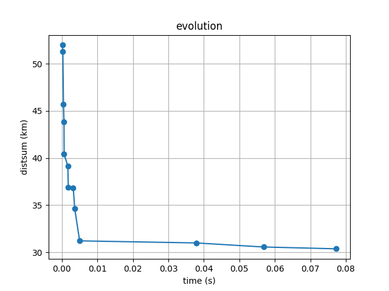
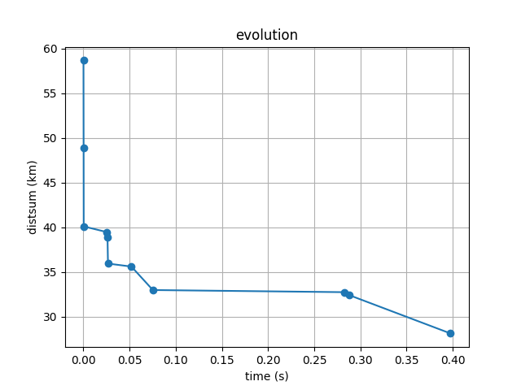
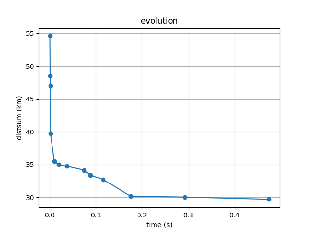
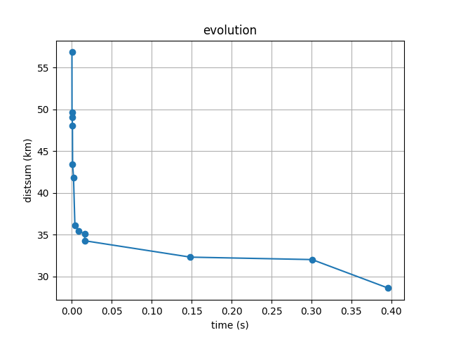
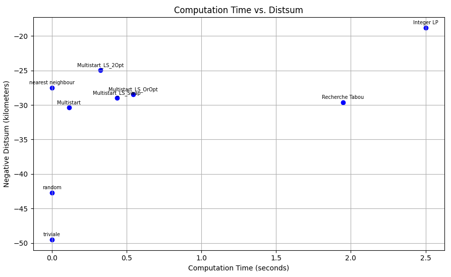
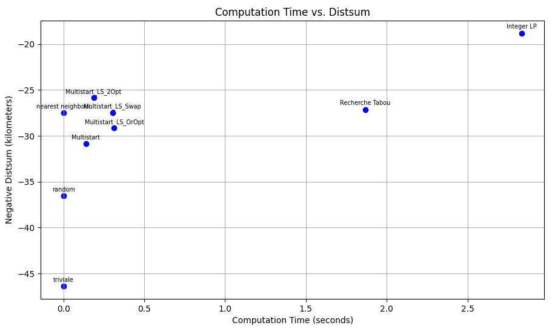
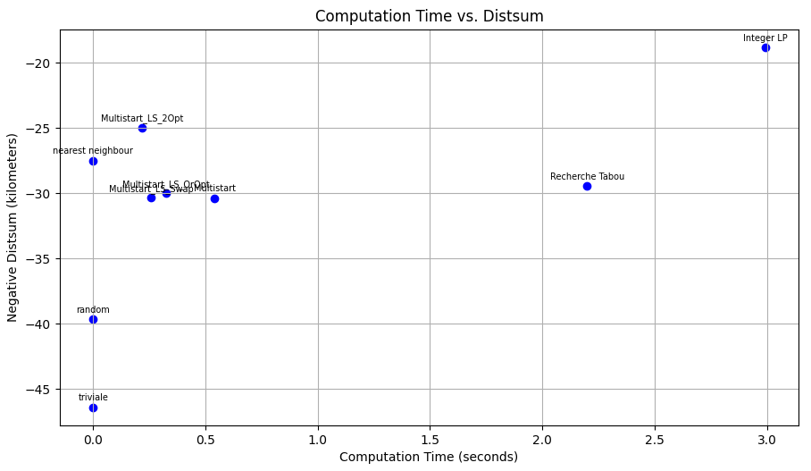
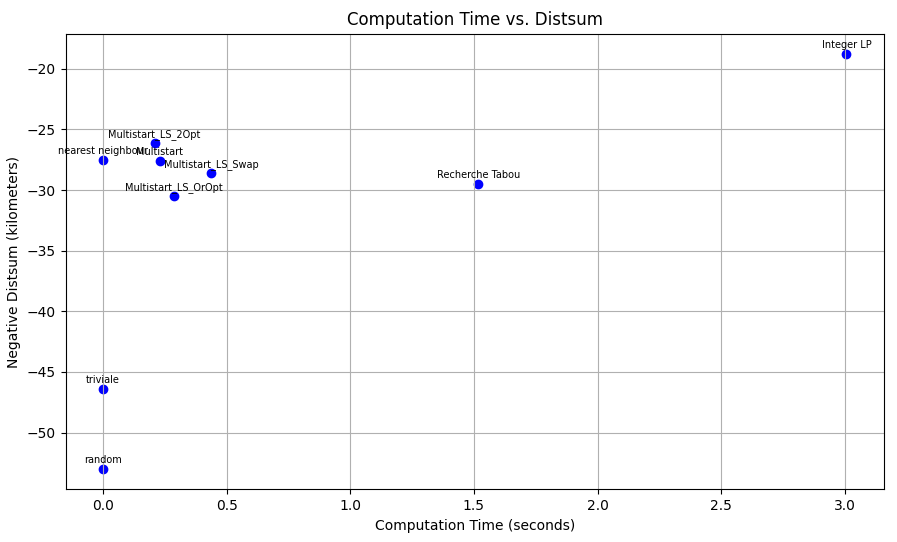

# TSP w/ Hubs.

### Members: 

- Massiles GHERNAOUT.
- Amine AIT MOKHTAR.

### Note: 
Me, Massiles, I'll take charge of the TSP w/ Hubs variant. Meanwhile, Amine will implement another variant.The reason for this dispatch is due to the fact that we couldn't meet to work together during these last weeks as a duo.

Also, I am sorry for the french and english mix, I've started coding with french but I couldn't keep it for long XD.

### Description & Brainstorming: 

**Impact on the mathematical model:**

I chose to tackle the Hub variant of the presented TSP problem.
The impact on the mathematical model is reduced to having a smaller vertex set, and thus a smaller arcs set.

In other words, the graph G will be reduced to a subgraph G' where G' = G \ W, W being the set of all nodes that
are the neighbors of a hub in G. (The hubs nodes stay in G', but not their non-hub neighbors)

This transformation (G->G') will be done before any resolution method gets invoked.

So the mathematical model will not change, it will just execute faster.

**The question becomes: How do we identify the Hubs ?**

Well, in this problem set, we do not have the arcs between the nodes. So the Hubs could not be identified by calculating the 
degrees distribution and then taking only those that are in the last quantile or so. That is not possible for this case.

But, we do have a routine that calculates the geometrical distance between all the points. One might say that a Hub is basically
a node that is at the center of a group of other nodes to which the distance does not exceed X% of the largest distance in the network.
X is to be defined.

i.e:
The idea-rundown will be as follows:
- we load our instance.
- we calculate the distances between all the node pairs.
- we keep track of the max and min distance.
- we map 20 or so (X=20%) from a 1-100 scale to a min.dist-max.dist scale. (just like the map function in Processing)
- So all the nodes that are at the center of a group (more than 3-4 nodes) of nodes to which the distance does not exceed that formula output, we mark them as Hubs.
- Then we reduce the graph to the set of hubs.

### Notes on the implementation and results:

So, as mentioned above, I've implemented the TSP w/ Hubs.
The routine that reduces the graph to a Hub only graph is called redhog (reduce to hub only graph).

This routine will:
- iterate over all the nodes.
- create a node to nodes struct that aggregates the neighbors of each node that are in a distance that is less then a prefixed node2hub distance.
- sort this structure in descending order relative to the list of neighbors length.
- iterate over the sorted list, and pick the nodes that have more than a prefixed hubDegree count of neighbors.
- Then if the hubs overlap, one is a hub for another and vice-versa, merge the set of neighbors of the smaller cluster to the bigger one. (too aggressive)
- Do this for all pairs of hubs.
- Create a new instance with the Hubs + the outliers (those that are not hubs and not reached by hubs).
- return the new instance.

How can this routine be improved/relaxed ?:
- make the hub selection logic iterative and do not just merge the smaller clusters to the bigger ones with which they overlap.
- If there is an overlap, prefer cherry picking the nodes that represent the overlap and add them to the closest hub neighbors list.
- If within the nodes that represent the overlap there is a hub, merge it as well and remove it from the hub list.
- update the hub list and the node2nodes struct along the way.
- Do this until there is no overlap.

**An overview on how the redhog routine reduces the graph to a hog:**

- Figure 1: the instance data plotted without any change.
- Figure 2: highlights all the potential hubs.
- Figure 3: highlights the reduced set of hubs.
- Figure 4: highlights the reduced set of hubs + outliers.
- Figure 5: the redhoged instance.

 

redhog a graph of 20 nodes (data/instance1.txt)
 

---

redhog a graph of 50 nodes (data/instance2.txt)
 

---

redhog a graph of 100 nodes (data/instance3.txt)
 
 

**Remarks on the code:**

So currently, my redhog routine is too aggressive, which is better for large data sets, but it might not be what is always needed.

Alongside that, I've implemented some of the other resolution routines/heuristics that were described in the handout of this problem set.

Then, there is the integration of the osmnx lib for the real world data and the visualization routines for better debugging and assessment.

On that, I've chosen to go with the charging_stations network of Le Havre. See the ./notes.txt for the rationale behind choosing an amenity.

Besides, I've added a switch to toggle the real-world-data mode and the local-data mode, which use different instances and nodes data and
different plotting strategies as well. (see the main entry point of the TSP.py script.)

 

**Results of the TSP w/ Hubs resolution on the Le Havre's charging_stations network:**

 

Le Havre's charging_stations network.
 

---

Le Havre's charging_stations network reduced to hubs only.
 

---

 

> ***Note That there is two overlapping points by the stadium (look at this picture zoom of the right-center zone).***
>
> ***This proves my remarks on the redhog routine.***

 

---

tsp_on_lh_charging_stations_network_with_trivial_resolution_strategy
 

---

tsp_on_lh_charging_stations_network_with_random_resolution_strategy
 

---

tsp_on_lh_charging_stations_network_with_compute_nearest_resolution_strategy
 

---

tsp_on_lh_charging_stations_network_with_integer_lp_resolution_strategy
 

---

 

***Hurestics:***

 

tsp_on_lh_charging_stations_network_with_multistart_resolution_strategy and its evolution
 

---

tsp_on_lh_charging_stations_network_with_multistart_with_2Ops_LS_resolution_strategy and its evolution
 

---

tsp_on_lh_charging_stations_network_with_multistart_with_Swap_LS_resolution_strategy and its evolution
 

---

tsp_on_lh_charging_stations_network_with_multistart_with_OrOpt_LS_resolution_strategy and its evolution
 

---

tsp_on_lh_charging_stations_network_with_tabou_search_resolution_strategy and its evolution
 

---

### Comparaison of the results:

***Note:***
>Keep in mind that most heuristics have a max_iteration argument that I've set to the POIs_count². So in our instance it should be 90*90. (check the logs while executing.)
>
>It can be that more iterations can improve the result, but it should not shift the conclusions that will be derived from the visual that much, since it will also increase computation time.

 

***How to read the visual of comparaison?***

To compare the results, I've chosen to go with a visualization that I've familiarized with in Finance. The idea of this visualization is to show which strategy has the
best ratio distsum to computation_time.

In Finances, this can be used to show which investment plan has the best ratio performance/ROI to volatility/risk.

Since the smaller the distsum the better, I've reversed the y axis which represents the total distance of the TSP path so as the smallest appears at the top.

The x axis represents the computation time.

Which means, on the far top right, we have the most correct solutions but that takes the longest computation time.

And at the far bottom left, we have the worst solutions but that takes little to no computation time.

The 50-50 tradeoff will be the center, of course.

 

Results comparaison on the TSP applied to Le Havre's charging_stations network with diffrent strategies. (run 1)
 
 

i.e:
As you can see Integer LP is the best in terms of distsum, but it takes much more time then the heuristics. So the tradeoff is well shown with this visual.

From this visual we can conclude that:
- Tabou search is really not a good resolution method, it takes more time than the heuristics and provides an equivalent result to most of them, but the heuristics are much much faster.
- Random and trivial resolution methods are the fastest but the worst in terms of distsum.
- The other interesting point is that if you can not afford the ilp computation time, you rather go with the nearest neighbour strategy, it is as fast as random and trivial and gives as good of a result compared to most hurestics.

---

**Other visuals comparing results of some subsequent executions (just to confirm the trends):**

 

Results comparaison on the TSP applied to Le Havre's charging_stations network with diffrent strategies. (run 2)
 
 

---

 

Results comparaison on the TSP applied to Le Havre's charging_stations network with diffrent strategies. (run 3)
 
 

---

 

Results comparaison on the TSP applied to Le Havre's charging_stations network with diffrent strategies. (run 4)
 
 

---

 

Results comparaison on the TSP applied to Le Havre's charging_stations network with diffrent strategies. (run 5)
 
 

As you can see, the trend is well confirmed !

It is up to you to choose your investment plan !  

Speed or Correctness ? ¨\\(°£°)/¨